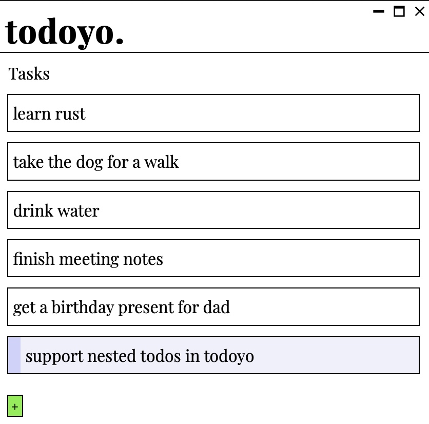

# todoyo

Todoyo is a minimalist todo app controlled entirely through vim motions.

It is designed to make the experience of editing a todo list as pleasant
and efficient as possible.

## Features

- [x] Vim style navigation
- [x] Persistent local storage
- [x] Support for multiple named todo lists
- [ ] Customizable themes
- [ ] Customizable keybindings
- [ ] Support for nested todo items
- [ ] Support for tags/coloured labels
- [ ] Search
- [ ] Copy and paste
- [ ] Extended todo descriptions
- [ ] Focus mode (show only a priority item)
- [ ] Pomodoro mode

## Dev

### Recommended IDE Setup

- [VS Code](https://code.visualstudio.com/) + [Tauri](https://marketplace.visualstudio.com/items?itemName=tauri-apps.tauri-vscode) + [rust-analyzer](https://marketplace.visualstudio.com/items?itemName=rust-lang.rust-analyzer)
